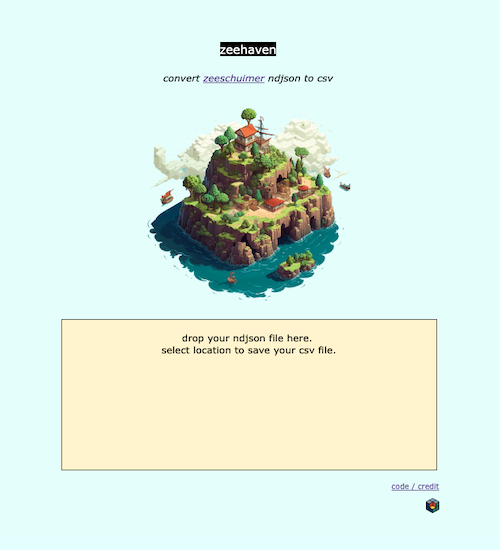

# zeehaven

a tiny tool to convert [zeeschuimer](https://github.com/digitalmethodsinitiative/zeeschuimer) ndjson files into csv format.

web interface available at: https://publicdatalab.github.io/zeehaven/

all data is converted locally.

if ndjson file is collected from instagram or twitter the tool structures the csv file accordingly, otherwise it outputs the whole ndjson file as a csv (which may contain many columns).

if you have suggestions or encounter problems you can [add an issue](https://github.com/PublicDataLab/zeehaven/issues). 

further context can be found in [this blog post](https://publicdatalab.org/2023/12/18/zeehaven-social-media-data/).

*developed by [iain](https://github.com/iaine/ndjson). themed by [jonathan](http://jonathangray.org/). seeded at a [Public Data Lab](https://publicdatalab.org/) summer worksheet sprint in 2023.*
